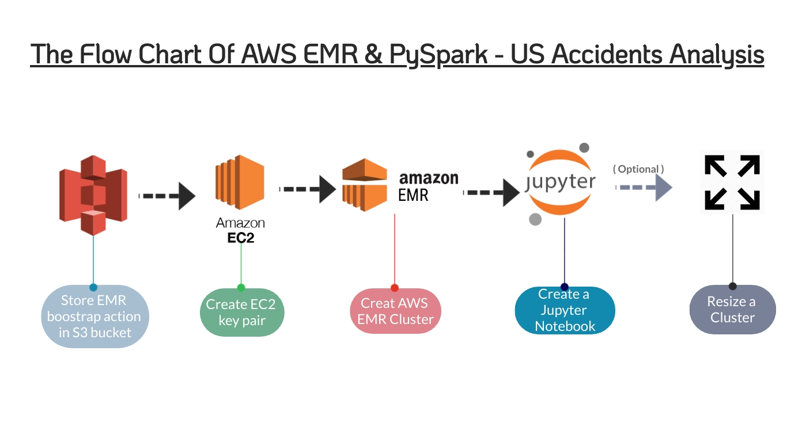

# AWS EMR & PySpark - US Accidents Analysis

Motivation:\
Amazon Elastic MapReduce (EMR) is an Amazon Web Services (AWS) tool for big data processing and analysis.\
The purpose of this project is familiar with the AWS EMR interface, analysisng data via a cloud cluster, and coding by PySpark.

# The project's flow chart

__Step 1. Store EMR boostrap action in S3 bucket__\

Create a bootstrap action for launching your cluster. You can find the file (emr_bootstrap.sh) in the repositories.

---

__Step 2. Create EC2 key pair__\

---

__Step 3. Creat AWS EMR Cluster__\

---

__Step 4. Create a Jupyter Notebook__\

After this phase, you can start your analysis.\
Even though the analysis was not the first priority in the project, I still briefly introduce it.\
The main goal of the analysis is to use selecting features to predict the severity of accidents in TX. I used two models - Logistic Regression & Randomforest Classifier.\

Additionally, I also run similar models on my personal laptop and compare the processing speed. When AWS EMR only have 2 instances, the processing speed on both platform (AWS EMR & My laptop) were approximately identical. Both need to spend 2~3 minutes. However, after I Increased instances size (increased to 4), EMR performed better.

---

__(Optional). Resize a Cluster__\

I original instances was two. But the processing speed was low. Therefore, I resize it from 2 to 4. And the processing speed increased obviously.

---

# Summary
After the project, I realized there are two advantages of using AWS.
__1. I don't need to set up a complicated configuration:__\
I had set up Hadoop and scala on my laptop. And the installation spent a lot of time. On the other hand, when I using AWS EMR, I only press several buttons and the whole environment is ready to go.
__2. Scaling easily:__\
In this project, I resize the instances effortlessly. This scaling feature is really useful. Especially on handling real-time huge datasets.

# Reference
[Launch AWS EMR Cluster](https://github.com/zz161/Pyspark-on-AWS-EMR)\
[Data Analysis](https://www.kaggle.com/phip2014/ml-to-predict-accident-severity-pa-mont)
